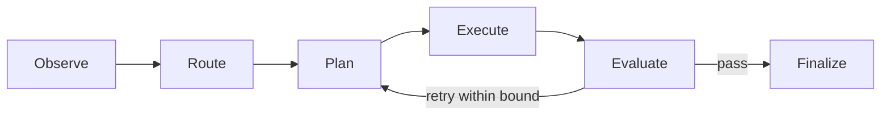

# Atlas Markdown and Mermaid

Use Markdown as the source of truth. Make diagrams small enough to review in a git diff and accurate without generated image assets.

## Workflow

1. Verify component names, transitions and stop conditions from current code, routes and schemas.
2. Select the smallest useful diagram:
   - flowchart for routing or adapter composition;
   - state diagram for loop transitions;
   - sequence diagram for controller interactions;
   - git graph or timeline only when history is the subject.
3. Use stable identifiers and short labels. Keep implementation detail outside the diagram unless it changes the contract.
4. Add a prose interpretation plus evidence and unknowns.
5. Check Mermaid syntax and confirm the diagram does not imply unsupported behavior.

## Output

````md
## <Title>

<Purpose in one sentence.>



- Evidence: `<file or contract>`
- Unknowns: <none or explicit list>
````

## Guardrails

- Never invent routes, adapters, transitions, providers or write capabilities.
- Preserve the distinction between core behavior and optional adapters.
- Do not introduce MQ as a core dependency.
- Do not include secrets, private paths or raw repository content.
- Skip diagrams when a short paragraph is clearer.

## Atlas sources

Prefer `atlas_core/controller.py`, `atlas_core/state.py`, `routes/routes.json`, schemas and `docs/architecture.md`.
